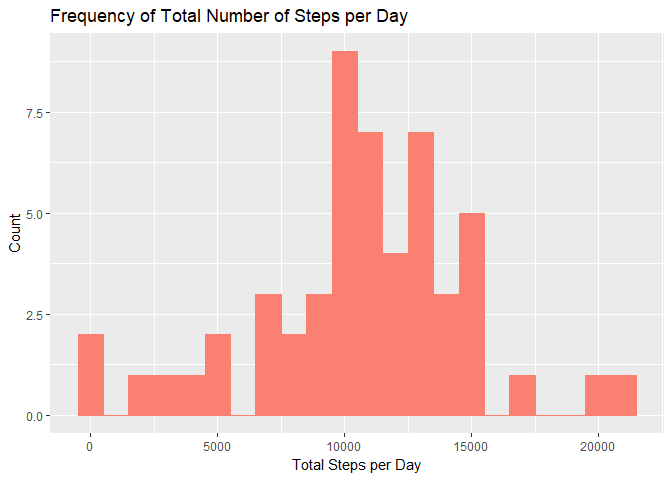
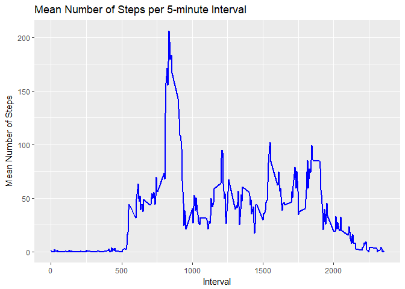
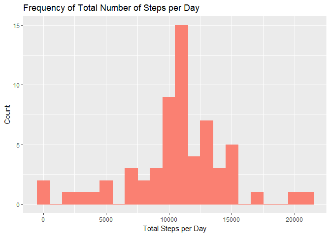
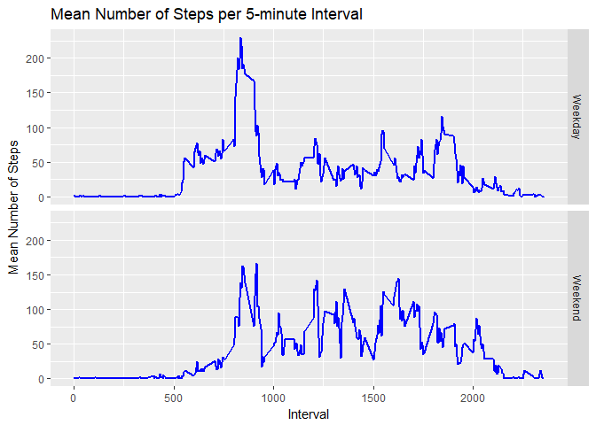

## Introduction
It is now possible to collect a large amount of data about personal movement using activity monitoring devices such as a Fitbit, Nike Fuelband, or Jawbone Up. These type of devices are part of the “quantified self” movement – a group of enthusiasts who take measurements about themselves regularly to improve their health, to find patterns in their behavior, or because they are tech geeks. But these data remain under-utilized both because the raw data are hard to obtain and there is a lack of statistical methods and software for processing and interpreting the data. 

This assignment makes use of data from a personal activity monitoring device. This device collects data at 5 minute intervals through out the day. The data consists of two months of data from an anonymous individual collected during the months of October and November, 2012 and include the number of steps taken in 5 minute intervals each day.

## Required Libraries
For this analysis, I am only using the ggplot2 library apart from base R. This library is loaded using the code below.

```r
library(ggplot2)
```

## Loading and preprocessing the data
This snippet of R code check for the zipped directory containing the data for this analysis and unzips the data into the **activity** directory. Once complete, the data is read in as a data frame and the date column is converted from string to Date type. I have included the a sample of data for quick reference.


```r
if(file.exists('./activity.zip')){
	 unzip(zipfile = 'activity.zip', exdir = './activity')
}
actdata= read.table('./activity/activity.csv', na.strings = c('NA'), sep = ',', header = TRUE)
actdata$date = as.Date(actdata$date, "%Y-%m-%d")
head(actdata)
```

```
##   steps       date interval
## 1    NA 2012-10-01        0
## 2    NA 2012-10-01        5
## 3    NA 2012-10-01       10
## 4    NA 2012-10-01       15
## 5    NA 2012-10-01       20
## 6    NA 2012-10-01       25
```

## What is the mean total number of steps taken per day?
We would like to understand more about the total number of steps taken over time. In order to begin this analysis, I am ingnoring all observations where the number of steps is NA. First, let's calculate the total number of steps taken each day from the dataset.

```r
actdata_narm = actdata[which(!is.na(actdata$steps)),]
totsteps = aggregate(actdata_narm[,c('steps')], by = list(actdata_narm$date), FUN = sum)
names(totsteps) = c("date", "tot_steps")
```

We can then display this data in a histogram format to understand the frequency of total steps taken per day.


```r
ggplot(data=totsteps, aes(totsteps$tot_steps)) + geom_histogram(binwidth = 1000, color = 'salmon', fill = 'salmon') + labs(title = 'Frequency of Total Number of Steps per Day', x = "Total Steps per Day", y = "Count")
```

<!-- -->

The histogram suggests that the total number of steps taken per day seems to be centered around 10000 steps. Thinking back to my personal experience with similar activity tracking products, the device typically rewards the user when they reach the default goal of 10000 steps, so this observation makes sense. Let's calculate the mean and median number of steps to help verify this observation.


```r
meandailysteps = mean(totsteps$tot_steps)
mediandailysteps = median(totsteps$tot_steps)
```

The mean number of steps taken per day is: 10766.19 steps.

The median number of steps taken per day is: 10765 steps.

These values are close to 10000 steps as expected and even slightly higher, suggesting that most subjects observed had more than 10000 steps of activity per day on average.

## What is the average daily activity pattern?
Next, we would like to analyze the average number of steps taken during each 5-minute interval. Let's calculate the average number of steps taken across all days per each interval.


```r
avgstepint = aggregate(actdata_narm[,c('steps')], by = list(actdata_narm$interval), FUN = mean)
names(avgstepint) = c("interval", "avg_steps")
```

Let's plot this data to see the average number of steps taken throughout the day.


```r
ggplot(data=avgstepint, aes(interval,avg_steps)) + geom_line(size = 1, color = 'blue') + labs(title = 'Mean Number of Steps per 5-minute Interval', x = "Interval", y = "Mean Number of Steps")
```

<!-- -->

We can immediately see from the time series plot that the interval in which the highest average number of steps taken is between 750 and 1000. Let's identify the true actual interval having the highest average steps.


```r
max_avg_int = avgstepint[which(avgstepint$avg_steps == max(avgstepint$avg_steps)),]$interval
```

The interval with the highest number of steps on average across all days in the dataset is 835, which aligns with what we observed in the time series plot.

## Imputing missing values
In the original dataset there are a number of days/intervals where there are missing values (coded as NA). The presence of missing days may introduce bias into some calculations or summaries of the data. Let's analyze these missing data first by calculating the total number of missing values in the dataset. **Note:** I am now using the dataset containing NA values.


```r
number_na = nrow(actdata[which(is.na(actdata$steps)),])
perc_na = round((nrow(actdata[which(is.na(actdata$steps)),])/nrow(actdata))*100,2)
```

The number of records with NA step values contained in the dataset is 2304 rows. This is 13.11% of the total number of observations. Let's impute the missing values using the data without NA values. Because we last analyzed the average step for each interval irrespective of the day, let's replace the missing values with the average steps calculated for the same interval. This will create a new dataset with no NA step observations.


```r
actdataimpute = actdata
for(i in 1:nrow(actdataimpute)){
  if(is.na(actdataimpute$steps[i])){
    actdataimpute$steps[i] = (avgstepint[which(avgstepint$interval == actdataimpute$interval[i]),]$avg_steps)
  }
}
head(actdataimpute)
```

```
##       steps       date interval
## 1 1.7169811 2012-10-01        0
## 2 0.3396226 2012-10-01        5
## 3 0.1320755 2012-10-01       10
## 4 0.1509434 2012-10-01       15
## 5 0.0754717 2012-10-01       20
## 6 2.0943396 2012-10-01       25
```

Now that we have imputed the data, let's create a histogram similar to the one we created previously to understand how imputing the missing values affected the mean and median values. First, calculate the total steps taken per day with imputed step values.


```r
totsteps_impute = aggregate(actdataimpute[,c('steps')], by = list(actdataimpute$date), FUN = sum)
names(totsteps_impute) = c("date", "tot_steps")
```

Then create the histogram to display the frequency of total steps taken per day.


```r
ggplot(data=totsteps_impute, aes(totsteps_impute$tot_steps)) + geom_histogram(binwidth = 1000, color = 'salmon', fill = 'salmon') + labs(title = 'Frequency of Total Number of Steps per Day', x = "Total Steps per Day", y = "Count")
```

<!-- -->

It seems the histogram has the same general shape as the original data, so imputing the values did not seem to have much of an effect on the shape. There are more counts centered around the mean, however.

Let's see if the the mean and median values from the imputed data are much different from the dataset in excluding NA values.


```r
meandailystepsimpute = mean(totsteps_impute$tot_steps)
mediandailystepsimpute = median(totsteps_impute$tot_steps)
meanvar = round((meandailystepsimpute/meandailysteps-1)*100,2)
medianvar = round((mediandailystepsimpute/mediandailysteps-1)*100,2)
```

The (imputed) mean number of steps taken per day is: 10766.19 steps.
This mean value is 0% from the dataset excluding NA values.

The (imputed) median number of steps taken per day is: 10766.19 steps.
This median value is 0.01% from the dataset excluding NA values.

These variances from the originally calculated means are relatively small, suggesting that imputing the missing values did not have much affect on the estimated total daily number of steps.

## Are there differences in activity patterns between weekdays and weekends?
Finally, lets see if there are differences in activity patterns between weekdays and weekends using the imputed dataset. We will need to create a factor variable containing two levels: "weekday" and "weekend"

This will be accomplished using the weekdays() function as described in the code below.


```r
actdataimpute$weekday = weekdays(actdataimpute$date)
actdataimpute$weekend_ind = ifelse(actdataimpute$weekday %in% c('Saturday', 'Sunday'), 'Weekend', 'Weekday')
actdataimpute$weekend_ind = as.factor(actdataimpute$weekend_ind)
```

Now that we are able to aggregate data based on weekend versus non-weekend activity, let's compare the time series plots. First, we will identify average activity per interval for weekends and weekdays.


```r
avgstepintwknd = aggregate(steps~interval+weekend_ind, actdataimpute, mean)
names(avgstepintwknd) = c('interval', 'weekend_ind', 'avg_steps')
```

Finally, we will plot the aggregated data as a time series using ggplot2 and faceting layout on weekend_ind to easily compare the weekend and weekday meansteps at each interval.


```r
ggplot(data=avgstepintwknd, aes(interval,avg_steps)) + geom_line(size = 1, color = 'blue') + labs(title = 'Mean Number of Steps per 5-minute Interval', x = "Interval", y = "Mean Number of Steps") + facet_grid(weekend_ind ~ .)
```

<!-- -->
